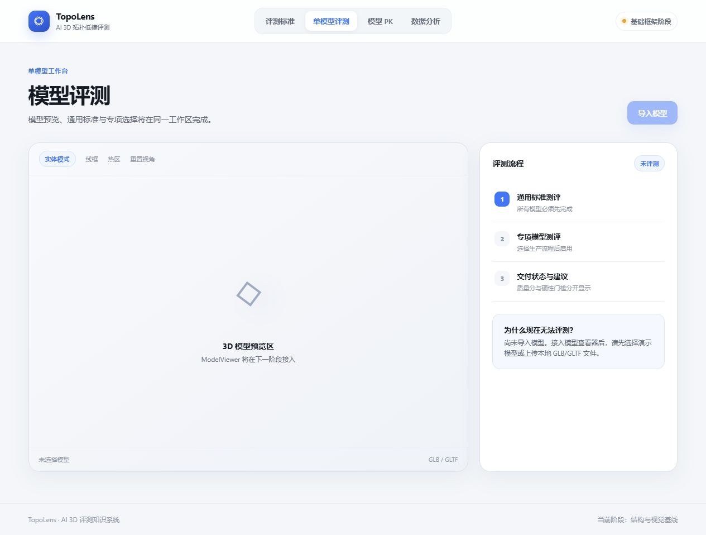
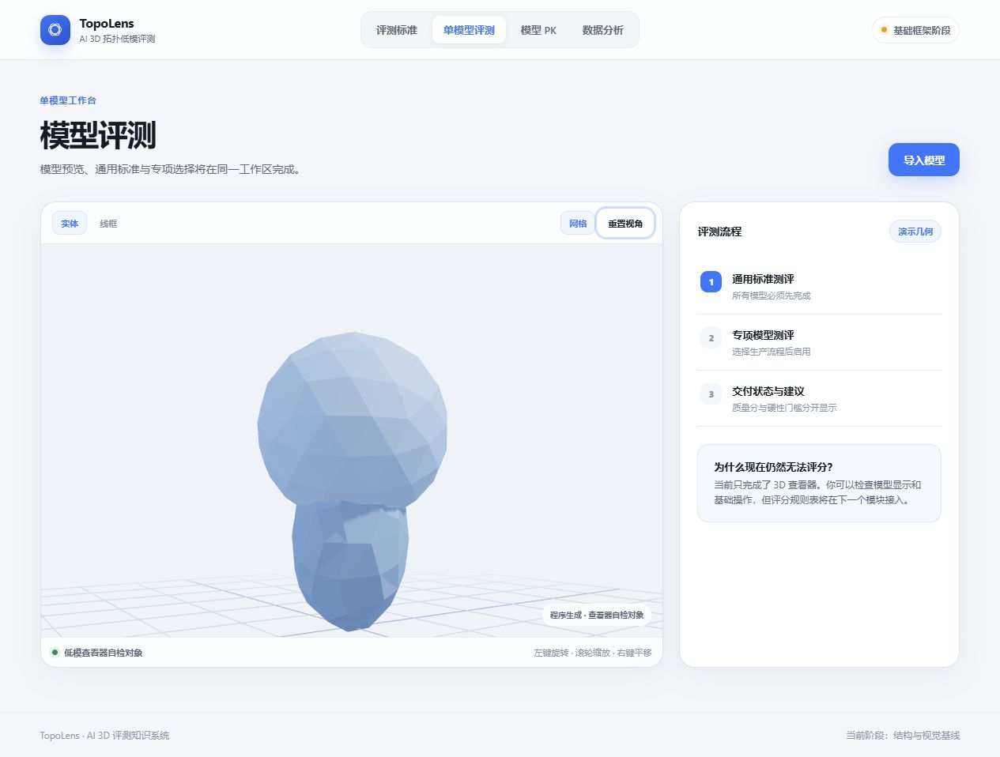
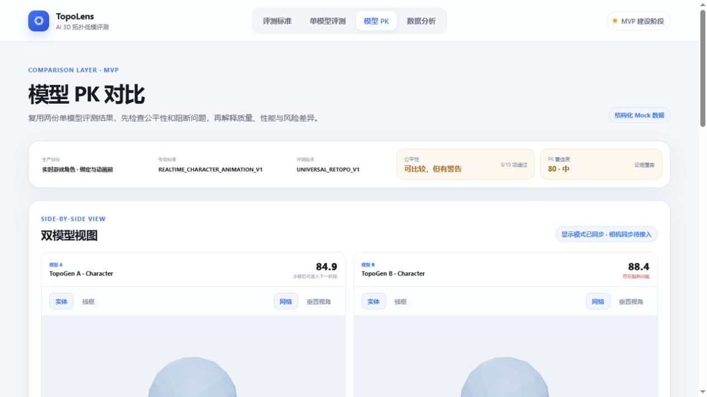
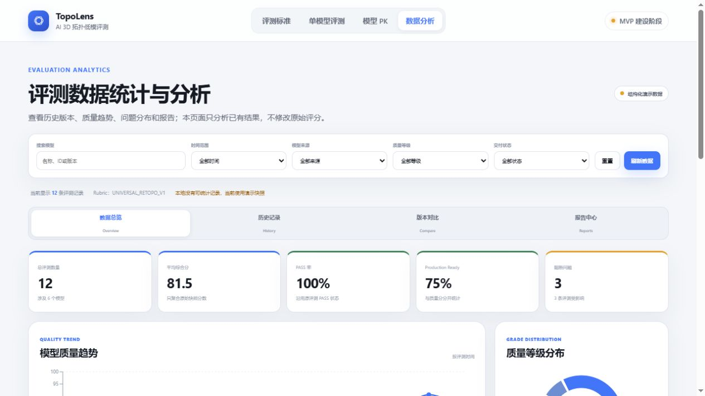

# AI 3D 拓扑低模评测工具

> 一个面向 AI 生成 3D 模型与低模资产的 Web 评测 Demo。
> 通过统一的拓扑标准、真实几何预检、模型 PK 和数据分析，帮助 3D 美术与项目团队更快判断模型是否适合进入后续生产流程。

## 关于我

我是一名 3D 模型师，也是这个项目的产品负责人。

虽然我没有传统的代码开发背景，但我长期参与 3D 资产制作，熟悉模型拓扑、边流、面数控制、变形需求和交付规范。在这个项目中，我尝试把 3D 美术经验转化为结构化评测规则，并借助 AI Coding 工具完成从需求梳理、产品设计到 Web Demo 验证的全过程。

我在项目中主要负责：

- 定义产品目标、核心用户和完整评测流程；
- 整理通用拓扑标准与专项生产标准；
- 设计评分维度、阻断规则和交付判断方式；
- 规划单模型评测、双模型 PK 与统计分析功能；
- 检查页面是否符合 3D 美术的真实工作习惯；
- 与 Codex 协作完成产品落地、测试和持续迭代。

## 项目背景

AI 3D 生成工具可以快速产出模型，但“能生成”不等于“能进入生产”。模型可能在外观上看起来完整，却仍然存在以下问题：

- 拓扑结构不适合绑定或动画变形；
- 局部面密度不合理，影响性能或后续编辑；
- 存在零面积面、异常法线或非流形结构；
- 轮廓、比例或关键结构不符合目标资产要求；
- 缺少统一标准，导致不同人员的评测结果难以比较；
- 分数看似较高，但仍存在不能交付的严重阻断问题。

这个项目希望建立一套可解释、可扩展的评测流程，让 3D 美术、技术美术、动画师和产品团队能够围绕同一套标准判断模型质量。

## 核心功能

### 1. 评测标准展示

- 以配置化方式管理通用评测维度和规则；
- 展示规则说明、权重、严重度和适用范围；
- 将通用基础评测与专项生产评测分层，避免不同标准互相覆盖。

### 2. 3D 模型浏览

- 支持 GLB、GLTF、OBJ 和 FBX 模型导入；
- 支持旋转、缩放、平移和重置视角；
- 支持实体、线框和地面网格显示切换；
- 模型仅在当前浏览器会话中使用，不保存用户模型文件。

### 3. 单模型质量评测

- 以七个通用维度展示模型质量；
- 区分综合得分、质量等级和 Production Ready 状态；
- 对阻断问题单独判断，不用高分掩盖严重风险；
- 通过配置自动生成评分表单，便于后续扩展评测规则。

### 4. 真实几何预检

导入模型后，浏览器可以真实读取：

- 网格对象数量；
- 缓冲顶点数量；
- 三角面数量；
- 文件大小与格式；
- 模型原始尺寸；
- 零面积或近零面积三角面；
- 缺失、零长度或非法法线。

真实几何预检不会冒充完整 AI 评测。边流质量、动画变形、形体对比和 AI 视觉判断仍属于后续能力。

### 5. 专项生产评测

专项规则根据以下生产上下文动态组合：

1. 模型来源（仅记录，不参与打分）；
2. 生产流程；
3. 资产类型；
4. 目标平台。

当前支持实时交互、动画、可视化、工程和数字孪生等方向。专项结果与通用原始分分别展示，不进行简单平均。

### 6. 模型 PK 对比

- 对两个模型进行并排查看和质量对比；
- 先检查对比条件是否公平，再给出结论；
- 2 分以内默认判定为持平，避免制造虚假的精确差距；
- 高分模型如果存在阻断问题，不推荐直接交付；
- 分别向 3D 美术、技术美术、动画和产品岗位提供差异说明与修改建议。

### 7. 评测数据统计与分析

- 展示样本数量、平均分、PASS 率、交付率和阻断情况；
- 展示质量等级分布、七维平均表现和高频问题；
- 分析算法或模型版本的质量变化趋势；
- 支持历史记录、同一模型版本对比和 JSON/CSV 报告导出；
- 明确标记真实本地记录与结构化演示数据。

## 页面预览









## 用户流程

```text
进入系统
  → 查看评测标准
  → 导入或选择模型
  → 完成真实几何预检
  → 查看通用基础评测
  → 选择生产流程、资产类型与目标平台
  → 加载专项评测规则
  → 获得分数、风险和修改建议
  → 保存记录或进入模型 PK
  → 在统计页面查看版本趋势与报告
```

## 开发过程

这个项目经历了两次明显不同的版本迭代。第一版让我快速看到了一个可以打开的网站，第二版则让我开始真正理解：AI 可以加快实现速度，但无法替代产品负责人完成需求拆解、知识整理和结果判断。

作为一名没有开发经验的 3D 模型师，我在这个过程中并不是一开始就找到了正确方法。相反，第一版的问题、第二版的重构以及后续开发中的误判，共同组成了这个项目最重要的实践记录。

### 版本迭代概览

#### 第一版：先做出一个可以打开的网站

第一版的目标是尽快把想法变成一个能够运行和访问的 Web 页面。这个版本已经实现了基础网站，但完成后我对内容并不满意。

主要问题包括：

- 整体产品框架过于薄弱；
- 模型分类与评分体系比较混乱；
- 系统给出的修改意见混杂在一起，没有按照问题类型或使用岗位进行区分；
- 评测标准缺少清晰定义，用户无法理解分数是怎样产生的；
- 页面虽然能够打开，却不能真正指导 3D 模型修改或生产判断。

第一版让我意识到，“做出一个网站”和“做出一个有用的评测产品”是两件完全不同的事情。基于这些问题，我没有继续在原有页面上增加功能，而是决定重新整理产品框架并制作第二版。

#### 第二版：先重建知识框架，再进入代码开发

在第一版制作完成后，我意识到：如果自己没有先整理清楚这个 Web 产品需要包含哪些专业知识、分类方式和评测逻辑，就无法仅靠一句需求让 AI 直接生成满意的结果。

因此，第二版开始前，我先与 ChatGPT 进行多轮沟通，把第一版遇到的问题、预期效果、核心用户和生产需求重新确认下来。之后，我为 Codex 制定开发规则：暂时不进入正式代码开发，而是先完成框架搭建和专业知识补充。

这一阶段的工作方式是：

1. 整理产品需要解决的问题和服务对象；
2. 重新构建模型分类、评测体系、评分体系和标准规则；
3. 先让 AI 生成可视化页面效果；
4. 根据页面效果检查信息层级和使用流程；
5. 继续补充或修改专业内容；
6. 等框架得到确认后，再逐步进入代码实现。

第二版生成的第一个页面原型仍然暴露出两个核心问题：

- 没有一套适用于所有模型的通用基础评测标准；
- 评分总览中的标准和分数含义不清晰，无法对用户起到实际指导作用。

这促使我进一步把评测体系拆分为“通用基础评测”和“专项生产评测”，同时要求评分结果必须能够解释问题、风险和修改方向，而不能只展示一个总分。

下面的阶段记录，主要对应第二版从框架重建到 Web Demo 实现的过程。

### 阶段 1：理解问题与整理评测标准

**目标**

先回答“这个产品到底解决什么问题”，而不是急着制作页面。

**主要工作**

- 阅读并整理已有的拓扑评测标准文档；
- 明确核心用户，包括 3D 美术、技术美术、动画师、产品负责人和 AI 模型研发人员；
- 梳理从模型导入、基础检测、专项评测到报告输出的完整流程；
- 检查文档之间的字段、分值、等级、严重度和阻断规则是否冲突；
- 将原本分散的专业描述整理为可以被程序读取的结构化规则。

**遇到的问题与决策**

最初的规则同时包含基础拓扑质量和具体生产要求。如果直接放进同一个总分，不同用途的模型会被同一套标准误判。例如，动画角色、实时游戏道具和 3D 打印模型的合格条件并不相同。

因此，我决定将评测体系分成两层：

- 第一层是所有模型都要经过的通用基础评测；
- 第二层是根据生产流程、资产类型和目标平台加载的专项评测。

这项决定成为后续页面、数据结构和评分逻辑的基础。

**阶段结果**

项目从一个宽泛的“模型打分工具”，变成了一套有明确用户、规则边界和生产流程的评测产品方案。

### 阶段 2：建立可扩展的产品与代码结构

**目标**

让规则和页面分离，避免每次修改评测标准都要重写界面。

**主要工作**

- 将评测维度、权重、等级和规则放入独立配置；
- 将评分、交付判断、PK、公平性检查和统计聚合拆分为独立模块；
- 统一模型记录、评测结果和问题项的字段结构；
- 规划首页、标准页、单模型评测、模型 PK 和统计分析页面；
- 建立统一的加载、空数据、成功、警告和错误状态。

**遇到的问题与决策**

如果把规则名称、分数和提示文字直接写在页面中，Demo 虽然能快速完成，但之后增加新资产类型或调整标准时会非常难维护。

因此，项目采用配置驱动方式：页面负责展示，服务模块负责计算，规则配置负责定义业务内容。这样以后新增生产目标或专项规则时，不需要重写整体页面结构。

**阶段结果**

形成了可以逐步扩展的前端结构，为后续真实检测、PK 和统计模块提供统一的数据基础。

### 阶段 3：完成评测标准与基础页面

**目标**

先让用户看懂系统如何评测，再让用户开始操作。

**主要工作**

- 建立首页与系统入口；
- 展示通用评测维度、规则说明和评分逻辑；
- 搭建单模型评测页面；
- 通过配置自动生成评分表单；
- 展示综合分、质量等级、维度结果和问题提示。

**遇到的问题与决策**

评测页面很容易只突出一个总分，但单一数字无法说明模型为什么得分，也无法告诉用户应该修改什么。

因此，页面不只展示总分，还保留维度得分、问题严重度、阻断状态、证据和建议。总分用于快速理解，详细规则用于支持实际修改。

**阶段结果**

用户可以从“看规则”自然进入“按规则评测”，并理解结果产生的原因。

### 阶段 4：开发 3D 模型查看器

**目标**

让评测不再停留在文字和数字层面，用户可以直接观察模型。

**主要工作**

- 使用 Three.js 和 React Three Fiber 渲染 3D 场景；
- 支持模型旋转、缩放和平移；
- 支持实体、线框和地面网格切换；
- 支持重置视角；
- 接入 GLB、GLTF、OBJ 和 FBX 文件导入；
- 在切换模型时释放几何、材质和贴图资源。

**遇到的问题与决策**

在实际交互测试中，发现“重置视角”按钮虽然能够恢复相机距离，却不能完整恢复初始观察方向。按钮在界面上看似正常，但实际行为不合格。

通过重新保存相机和控制器的初始状态，最终保证用户无论怎样旋转和缩放，都可以回到完整模型的默认视角。这也让我意识到：页面能打开不代表功能已经完成，3D 工具必须通过真实操作验证。

**阶段结果**

形成了可以在多个页面复用的 ModelViewer 公共组件，3D 查看功能通过浏览器交互验收。

### 阶段 5：接入真实几何预检

**目标**

让 Demo 开始读取真实模型信息，而不是一直依赖演示数字。

**主要工作**

- 读取网格对象数、缓冲顶点数和三角面数；
- 读取文件格式、大小与模型原始尺寸；
- 检查零面积或近零面积三角面；
- 检查缺失、零长度或非法法线；
- 将真实读取结果与演示评分明确区分。

**遇到的问题与决策**

GLB、GLTF、OBJ 和 FBX 在载入浏览器后通常已经三角化，系统不能可靠恢复建模软件中的原始四边面结构。如果强行计算“四边面比例”或“边流质量”，会产生看似专业但并不可信的结果。

因此，我选择只展示当前能够可靠读取的数据，并明确说明真实预检不等于完整 AI 评测。边流、环线、动画变形和形体判断被保留为后续能力。

**阶段结果**

系统第一次从纯展示 Demo 进入真实模型数据分析，同时保留了清晰的能力边界。

### 阶段 6：建立第二层专项生产评测

**目标**

让同一个模型可以根据不同生产目的接受不同的专项检查。

**主要工作**

- 记录模型来源，但不把来源直接作为质量分；
- 建立实时交互、动画、可视化、工程和数字孪生等生产流程；
- 建立角色、生物、道具、硬表面、场景等资产分类；
- 增加目标平台和制作阶段信息；
- 根据“生产流程 + 资产类型 + 目标平台”组合专项规则；
- 分别显示通用评测结果与专项评测状态。

**遇到的问题与决策**

专项标准不能替换通用标准，也不能与通用分数简单平均。例如，一个模型的基础网格可能健康，但不满足移动端性能预算；反过来，面数很低的模型也不代表拓扑一定合理。

因此，专项评测作为第二层独立结果存在，用来回答“是否适合某个生产场景”，通用评测则回答“模型基础质量是否健康”。

**阶段结果**

系统从通用模型检查工具扩展为能够理解生产上下文的评测框架。

### 阶段 7：开发模型 PK 对比

**目标**

帮助团队比较两个方案，但避免只用总分简单决定输赢。

**主要工作**

- 建立双模型并排查看与评分对比；
- 在比较前检查规则版本、生产目标和资产类型是否一致；
- 计算维度差异、问题变化和阻断风险；
- 分别生成面向 3D 美术、技术美术、动画和产品岗位的反馈；
- 将公平性、差异、置信度和推荐逻辑拆分为独立函数。

**遇到的问题与决策**

如果两个模型使用不同标准或面向不同生产目标，即使都有分数，也不能公平比较。另外，细小分差不应该被包装成明确胜负。

因此，系统在比较前先判断条件是否有效；2 分以内默认判为持平；高分模型存在阻断问题时，也不会被推荐直接交付。

**阶段结果**

PK 不再只是排行榜，而是一套带有公平性检查、风险判断和岗位建议的决策工具。

### 阶段 8：开发数据统计与版本分析

**目标**

让单次评测结果可以积累为长期质量信息。

**主要工作**

- 汇总评测数量、平均分、PASS 率、交付率和阻断情况；
- 展示等级分布、七维表现和高频问题；
- 支持历史记录筛选和排序；
- 支持同一模型不同版本的变化分析；
- 支持 JSON 和 CSV 报告导出；
- 区分本地真实记录与结构化演示数据。

**遇到的问题与决策**

旧的本地记录字段较少，而新的统计结构包含更完整的 Evaluation Snapshot。如果直接改写旧数据，可能导致记录丢失或含义变化。

因此，系统增加了数据适配层，只在读取统计时转换旧记录，不覆盖原始数据。版本对比也被限制为同一个模型的不同版本，避免把无关模型的差异解释成版本进步。

**阶段结果**

系统可以从单次评测进一步观察版本质量趋势，为算法迭代和资产验收提供依据。

### 阶段 9：持续测试与迭代

每完成一个模块，我都会要求进行与风险相匹配的验证，而不是只检查页面是否成功显示。验证包括：

- 代码规范检查；
- 正式构建检查；
- 核心计算逻辑测试；
- 浏览器页面与交互测试；
- 3D 旋转、缩放、切换和重置测试；
- 数据筛选、版本对比和报告入口测试；
- 原有页面回归检查；
- 页面截图与阶段成果记录。

开发过程中发现并修复的问题，往往来自实际操作而不是静态代码检查。例如相机重置不完整、版本对比默认选择了不同模型，以及演示数据与真实数据标记不够清楚。这些问题也推动产品规则变得更严谨。

### 当前版本的完成度与限制

第二版投入了较多时间搭建整体框架，并为每个模块补充专业知识、字段和规则。这些工作提高了系统的完整性与可扩展性，但也压缩了真正用于完善 Web 功能和真实模型测试的时间。

因此，目前完成的主要是概念框架、核心页面和部分真实几何预检。系统还不能对任意模型自动完成所有规则检测并输出一份完全可靠的最终评测报告，许多能够进一步改善用户体验的细分功能也尚未加入。

我选择在文档中明确说明这些限制，因为当前版本的价值主要是验证产品结构、评测逻辑和关键流程，而不是把尚未完成的能力描述成可用功能。

## 问题与思考

这一部分不再重复每个阶段的具体问题，而是总结开发过程中逐渐形成的核心认识。

### 1. 开发顺序与 AI 协作方式需要重新设计

因为缺少开发经验，我在第二版中曾经做出一个错误判断：先完成庞大的知识框架，再填充大量内容，却迟迟没有建立一个最小可运行的基础版本。

在与 AI 沟通时，我也一度过于想当然，认为只要把全部材料交给 AI，它就会自动理解优先级，并直接给出满意的产品。真正开始实现后，我才发现部分功能关系混乱，一些最核心的能力没有落地，AI 对需求的理解也和我的预期存在偏差。之后花费了大量时间重新解释、修改和调整。

这次经历让我认识到，问题并不是“提供给 AI 的内容不够多”，而是缺少清晰的开发顺序、阶段目标和验收标准。大量文档不能自动转化为正确产品，AI 也无法替我判断什么必须先做、什么可以延后。

如果重新开始，我会采用以下方式：

- 先建立能够运行的最小基础框架，再逐步添加规则和内容；
- 优先打通“导入模型 → 检测 → 查看问题 → 获得建议”的核心闭环；
- 每次只开发一个页面或一个可验证模块；
- 在开发前明确本轮目标、不做什么以及怎样才算完成；
- 尽早使用真实模型测试，而不是等知识框架全部完成后再验证；
- 把专业内容分批接入，通过实际页面反馈判断是否需要继续扩充；
- 不把“AI 已经生成代码”视为完成，而以实际功能和用户体验作为验收依据。

### 2. 3D 质量不能只由一个总分定义

总分适合快速浏览，却可能掩盖严重风险。一个模型可以在多数维度表现良好，但只要存在非流形结构、关键法线错误或其他阻断问题，就可能无法交付。

因此，这个项目把“质量得分”和“是否可交付”分开。分数表达整体表现，阻断规则表达生产底线，两者不能互相替代。

### 3. 通用标准与生产标准必须分层

模型基础健康与是否适合特定用途，是两个不同问题。通用标准应该保持稳定，专项标准则需要根据游戏、动画、工程或其他生产场景变化。

分层之后，系统既能保持跨模型比较的一致性，也能保留真实生产中的差异。

### 4. 工具必须诚实说明数据来源与能力边界

在 AI 产品中，最危险的不是功能暂时不完整，而是把演示结果包装成真实判断。本项目会明确标记真实读取、结构化 Mock、人工输入和暂未检测的内容。

我认为可信度比“看起来什么都能做”更重要。一个能够说明自己不知道什么的评测工具，才有机会真正进入生产流程。

### 5. 规则结构比页面数量更重要

页面可以快速生成，但如果字段、权重、严重度和规则关系不统一，后续每增加一个功能都会产生新的冲突。

这个项目花了较多时间整理规则、统一命名和划分模块。虽然这部分不一定最直观，却决定了产品能否继续扩展。

### 6. AI Coding 仍然需要专业负责人做判断

Codex 可以高效分析文档、生成代码和执行测试，但它无法代替我决定什么是合理的拓扑、哪些风险会阻断交付，以及不同岗位真正需要看到什么。

这次实践让我认识到，非程序员使用 AI 开发产品时，最重要的能力不是记住代码语法，而是清楚表达问题、提供领域知识、控制范围、检查结果并做出决策。

### 7. Demo 的价值是验证，而不是假装已经完成

当前产品仍有真实检测和服务端能力尚未实现，但 Demo 已经验证了评测分层、用户流程、数据结构、页面交互和决策逻辑是否能够成立。

对我来说，第一阶段最重要的结果不是功能数量，而是把一个模糊想法变成可以观察、讨论和继续迭代的产品。

## 技术方案

- React 19：页面与组件开发；
- Vite 8：本地开发和正式构建；
- Three.js / React Three Fiber：3D 模型渲染与交互；
- React Router：页面路由管理；
- Recharts：统计图表；
- localStorage：保存轻量评测记录与用户选择；
- Oxlint：代码规范检查。

项目采用配置与界面分离的方式管理评测规则。评分、PK、公平性判断、统计聚合和报告导出分别放在独立模块中，减少业务规则被写死在页面里的风险。

## AI 协作方式

本项目主要使用 Codex 作为 AI Coding 协作工具。

我负责提供 3D 专业判断、产品目标、规则文件、页面反馈和最终决策；Codex 负责协助完成文档分析、冲突检查、架构设计、代码实现、浏览器测试和问题修复。

典型协作过程包括：

1. 我先定义本轮只解决的业务问题和验收目标；
2. Codex 阅读现有规则与代码，说明准备修改的范围；
3. 我确认产品方向，补充 3D 生产知识；
4. Codex 实现功能并运行代码检查、构建和浏览器交互测试；
5. 根据实际页面效果继续发现问题并迭代，例如修复 3D 查看器重置视角、限制版本对比必须来自同一模型等。

AI 在这里不是替代产品负责人，而是帮助我把专业经验更快转化为可以验证的产品。

## 本地运行

```bash
npm install
npm run dev
```

正式构建：

```bash
npm run build
```

其他检查：

```bash
npm run lint
npm run test:comparison
npm run test:specialized
```

## 当前状态

已完成：

- 通用评测标准展示；
- 3D 模型查看器；
- 配置化评分表单；
- 基础真实几何预检；
- 专项生产上下文与规则组合；
- 模型 PK 对比；
- 评测数据统计与分析；
- JSON/CSV 报告导出；
- 页面交互测试、代码检查和正式构建验证。

仍在迭代：

- 完整自动拓扑检测；
- AI 视觉与边流判断；
- 真实高低模形体误差对比；
- UV、烘焙和动画变形专项检测；
- 真实项目数据和服务端存储；
- PDF 报告生成；
- 在线部署与更多真实模型验证。

## 项目地址

- 在线体验：`待补充`
- GitHub：[https://github.com/Robin260/ai-3d-topology-review](https://github.com/Robin260/ai-3d-topology-review)

## 总结

这个项目不只是一个模型评分页面，也是我从 3D 模型师走向 AI 产品实践的一次完整尝试。

在开发过程中，我把长期积累但难以量化的 3D 美术经验，逐步整理成评测维度、规则、字段、阻断条件和用户流程；再通过与 Codex 协作，把这些内容转化为可以运行、操作和验证的 Web Demo。

在制作这个 Demo 的过程中，我始终希望从一个真实存在的需求出发，完整分析它所服务的核心群体和使用对象，并以最终能否落地为导向，构建一套可以持续升级、补充和扩展的系统。

这个过程并不顺利。第一版虽然快速完成，却暴露出框架薄弱和标准混乱的问题；第二版虽然重新建立了更完整的知识体系，却也因为过度投入框架与内容设计，压缩了功能实现和真实测试的时间。这些结果让我更清楚地认识到，产品开发需要在专业深度、实现顺序和验证速度之间不断取得平衡。

这次实践让我完成了三个重要转变：

- 从依靠个人经验判断，转向设计可解释、可复用的评测标准；
- 从只关注模型制作结果，转向思考用户、流程、数据和产品决策；
- 从认为开发必须先掌握大量代码，转向学习如何借助 AI 管理复杂任务并验证结果。

当前 Demo 已经证明，这套产品思路可以连接 AI 生成模型、3D 美术标准和真实生产流程。它仍然需要更多真实模型、自动检测能力和生产数据来验证，但已经建立了一个清晰、诚实并且可以继续扩展的起点。

未来，我希望继续完善真实拓扑检测、专项生产规则和数据分析能力，让它不仅能够展示“模型得了多少分”，还能够真正回答三个更重要的问题：

1. 这个模型的问题在哪里？
2. 为什么这些问题会影响生产？
3. 应该怎样修改，才能让模型进入下一阶段？
